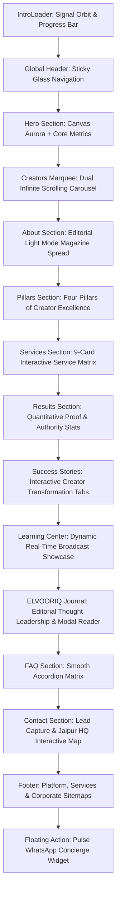

# ELVOORIQ Landing Page: Comprehensive Architectural, UI/UX & Content Documentation

> **Document Version:** 1.0.0  
> **Target Audience:** UI/UX Designers, Frontend Engineers, Brand Strategists, Creative Directors  
> **Objective:** Complete documentation of the current UI/UX stack, technical stack, animation architecture, component hierarchy, design guidelines, and full verbatim copywriting to serve as the blueprint for the upcoming project facelift.

---

## Table of Contents

1. [Executive Summary & Brand Philosophy](#1-executive-summary--brand-philosophy)
2. [Technology Stack Specifications](#2-technology-stack-specifications)
3. [UI/UX Design System & Token Dictionary](#3-uiux-design-system--token-dictionary)
4. [Animation Stack & Motion Design Principles](#4-animation-stack--motion-design-principles)
5. [Complete Landing Page Section Catalog & Copywriting](#5-complete-landing-page-section-catalog--copywriting)
   - [5.1 Intro Preloader (`IntroLoader`)](#51-intro-preloader-introloader)
   - [5.2 Global Header & Navigation (`Header`)](#52-global-header--navigation-header)
   - [5.3 Hero Section & Canvas Dynamics (`Hero` & `HeroLottieBackground`)](#53-hero-section--canvas-dynamics-hero--herolottiebackground)
   - [5.4 Creators Marquee (`CreatorsMarquee`)](#54-creators-marquee-creatorsmarquee)
   - [5.5 About Section (`AboutSection`)](#55-about-section-aboutsection)
   - [5.6 Ecosystem Pillars (`PillarsSection`)](#56-ecosystem-pillars-pillarssection)
   - [5.7 Services Catalog & Modals (`ServicesSection` & `ServiceModal`)](#57-services-catalog--modals-servicessection--servicemodal)
   - [5.8 Quantitative Results & Proof (`ResultsSection`)](#58-quantitative-results--proof-resultssection)
   - [5.9 Creator Success Stories & Case Studies (`SuccessStoriesSection` & `StoryModal`)](#59-creator-success-stories--case-studies-successstoriessection--storymodal)
   - [5.10 Learning Center & Live Streams (`LearningCenterSection`)](#510-learning-center--live-streams-learningcentersection)
   - [5.11 The ELVOORIQ Journal (`JournalSection` & `JournalArticlesModal`)](#511-the-elvooriq-journal-journalsection--journalarticlesmodal)
   - [5.12 Frequently Asked Questions (`FAQSection`)](#512-frequently-asked-questions-faqsection)
   - [5.13 Contact & Headquarters Map (`ContactSection`)](#513-contact--headquarters-map-contactsection)
   - [5.14 Global Footer & Sitemaps (`FooterSection`)](#514-global-footer--sitemaps-footersection)
   - [5.15 Floating WhatsApp Widget (`WhatsAppButton`)](#515-floating-whatsapp-widget-whatsappbutton)
6. [Design Guidelines & Facelift Blueprint](#6-design-guidelines--facelift-blueprint)

---

## 1. Executive Summary & Brand Philosophy

**ELVOORIQ** is an enterprise-grade digital talent management agency and creator ecosystem founded in 2018. Designed specifically around the ethos **"Built for Women Who Lead"**, the platform operates at the intersection of high-fashion luxury representation, multi-platform live streaming syndication, legal contract safeguarding, and scalable influencer monetization.

The public landing page acts as the premiere digital gateway for:
1. **Prospective Creators:** Looking for 360-degree talent management, brand sponsorships, and career elevation.
2. **Global Brand Partners:** Seeking curated collaborations with high-engagement female creators across fashion, beauty, gaming, tech, and lifestyle.
3. **Enterprise Talent Managers & Agents:** Navigating to secure operational workspaces and administrative portals.

### Visual Identity Tone
- **Elite & Editorial:** Blending timeless serif typography (`Playfair Display`) with modern tech-forward interfaces.
- **Atmospheric Dark Mode:** Deep obsidian backgrounds (`#0B0C10` / `#0C0C0C`) accented with neon emerald gradients (`#189380`, `#00C988`, `#00E599`) and cosmic purples (`#8A2BE2`).
- **Editorial Light Interlude:** An intentional high-contrast cream/off-white section (`#F8F9FA`) in the About block, reminiscent of high-fashion luxury magazines (Vogue, Harper's Bazaar), before returning to the cyber-luxury dark aesthetic.

---

## 2. Technology Stack Specifications

The frontend is built on a modern Single Page Application (SPA) architecture engineered for zero-latency transitions and high visual performance:

| Category | Technology / Library | Version | Role in Architecture |
|---|---|---|---|
| **Core Framework** | `React` | `^19.2.7` | UI component tree, hooks, declarative rendering |
| **DOM Renderer** | `react-dom` | `^19.2.7` | High-performance React 19 reconciliation |
| **Build Tooling & Bundler** | `Vite` | `^8.1.1` | Ultra-fast HMR, ES module bundling, tree shaking |
| **Routing Engine** | `react-router-dom` | `^7.18.1` | Client-side routing, route-level protection, modal state persistence |
| **Motion & Transitions** | `framer-motion` | `^12.42.2` | Complex scroll-triggered animations, spring physics, layout shifts, modal entries/exits |
| **Vector Animation** | `lottie-react` | `^2.4.1` | JSON vector animation integration |
| **Iconography** | `lucide-react` | `^1.25.0` | Minimalist, consistent, clean vector SVG icons |
| **State Management** | `zustand` | `^5.0.14` | Global application state, authentication tokens, UI persistence |
| **Real-time Networking** | `socket.io-client` | `^4.8.3` | Bi-directional WebSocket subscriptions for live creator and video updates |
| **HTTP Client** | `axios` / Native `fetch` | `^1.18.1` | REST API communication with the Node.js / Express backend |
| **Canvas Graphics** | Native `HTML5 Canvas 2D` | N/A | Procedural mouse-tracking fluid waves, starfield particles, and aurora mesh |
| **Cryptography** | Web Crypto API (`window.crypto`) | N/A | In-browser HMAC-SHA256 signature verification for telemetry security |
| **Linting & Quality** | `oxlint` | `^1.71.0` | Rust-based high-speed static code analysis |

---

## 3. UI/UX Design System & Token Dictionary

### 3.1 Color Palette & Token Variables

The global color palette is declared in `frontend/src/index.css` and extended within section-specific style sheets:

```css
:root {
  color-scheme: dark;
  
  /* Primary Brand Neon Accents */
  --color-primary: #189380;          /* Deep Emerald Teal */
  --color-primary-hover: #137767;    /* Darkened Emerald Hover */
  --color-neon-emerald: #00C988;     /* Bright Cyber Emerald */
  --color-electric-mint: #00E599;    /* Luminous Mint */
  
  /* Complementary Atmospheric Hues */
  --color-sapphire: #0284C7;         /* Deep Sky Sapphire */
  --color-purple-royal: #8A2BE2;     /* Electric Indigo / Purple */
  --color-purple-neon: #9D4EDD;      /* Luminous Violet */
  --color-gold-accent: #E5C158;      /* Warm Luxury Gold (Map Pin & Accents) */
  
  /* Dark Mode Background Foundations */
  --color-bg-space: #0B0C10;         /* Deep Obsidian Black (Canvas Base) */
  --color-bg-darker: #0C0C0C;        /* Ultra Dark Matte Black */
  --color-bg-dark: #121212;          /* Standard Dark Slate */
  --color-bg-portal: #030506;        /* Deep Glassmorphic Portal Base */
  
  /* Editorial Light Mode (About Section) */
  --color-light-bg: #F8F9FA;         /* Clean Editorial Off-White */
  --color-light-card: #FFFFFF;       /* Pure White Feature Cards */
  --color-light-muted: #F3F4F6;      /* Subtle Neutral Container */
  --color-light-text-title: #111827; /* Deep Charcoal Title */
  --color-light-text-body: #4B5563;  /* Slate Neutral Body */
  
  /* Typography Colors */
  --color-text-main: #FFFFFF;        /* Crisp White */
  --color-text-muted: #A3A3A3;       /* Balanced Gray */
  --color-text-dim: #6B7280;         /* Low-contrast Secondary Gray */
  
  /* Borders & Glassmorphism */
  --color-border: rgba(255, 255, 255, 0.1);
  --color-border-emerald: rgba(24, 147, 128, 0.2);
  --glass-bg: rgba(12, 12, 12, 0.98);
}
```

### 3.2 Typography Tokens

- **Editorial Serif:** `'Playfair Display', Georgia, serif`
  - Used for: Display headlines (`.hero-title`, `.about-title`, `.pillars-title`, `.services-title`, `.stat-number`).
  - Weights: `400` (Regular), `500` (Medium italic for accents), `600` (SemiBold), `700` (Bold).
- **Interface Sans-Serif:** `'Inter', system-ui, -apple-system, sans-serif`
  - Used for: Body text, navigation links, buttons, statistics labels, badges, form controls.
  - Weights: `400` (Regular), `500` (Medium), `600` (SemiBold), `700` (Bold), `800` (ExtraBold).
- **Monospace:** `monospace, Consolas, Courier New`
  - Used for: Percentage monitors, code telemetry, and technical timestamps.

### 3.3 Spatial Scale & Breakpoints

- **Max Container Width:** `1280px` centered with auto margins.
- **Desktop Gutters:** `padding: 0 2rem;`
- **Mobile Gutters:** `padding: 0 1.25rem;`
- **Standard Radius Scale:**
  - Badges & Pills: `9999px` (Full round)
  - Cards & Content Blocks: `1rem` (16px) to `1.5rem` (24px)
  - Luxury Editorial Blocks: `4rem` (64px) top corner radii on `.about-section`
- **Responsive Breakpoints:**
  - `Desktop`: `> 1024px`
  - `Tablet`: `768px – 1024px`
  - `Mobile`: `480px – 768px`
  - `Small Mobile`: `< 480px`

---

## 4. Animation Stack & Motion Design Principles

Animation in ELVOORIQ is carefully choreographed to feel responsive, silky, and high-status, avoiding cheap or jarring bouncy effects.

### 4.1 Framer Motion Variant Library (`frontend/src/utils/animations.js`)

All standard section scroll reveal variants utilize a bespoke cubic-bezier curve: `[0.25, 1, 0.5, 1]`.

```javascript
// Fade In Up - Main revelation
export const fadeInUp = {
  hidden: { opacity: 0, y: 30 },
  visible: { 
    opacity: 1, 
    y: 0,
    transition: {
      duration: 0.8,
      ease: [0.25, 1, 0.5, 1] // Custom smooth, premium feel
    }
  }
};

// Fade In Left - Side slide
export const fadeInLeft = {
  hidden: { opacity: 0, x: -30 },
  visible: { 
    opacity: 1, 
    x: 0,
    transition: {
      duration: 0.8,
      ease: [0.25, 1, 0.5, 1]
    }
  }
};

// Fade In Right - Side slide
export const fadeInRight = {
  hidden: { opacity: 0, x: 30 },
  visible: { 
    opacity: 1, 
    x: 0,
    transition: {
      duration: 0.8,
      ease: [0.25, 1, 0.5, 1]
    }
  }
};

// Stagger Container - Orchestrates child card reveals
export const staggerContainer = {
  hidden: { opacity: 0 },
  visible: {
    opacity: 1,
    transition: {
      staggerChildren: 0.15,
      delayChildren: 0.1
    }
  }
};

// Scale Up - Modals & interactive overlays
export const scaleUp = {
  hidden: { opacity: 0, scale: 0.95 },
  visible: {
    opacity: 1,
    scale: 1,
    transition: {
      duration: 0.8,
      ease: [0.25, 1, 0.5, 1]
    }
  }
};
```

### 4.2 Procedural Canvas Engine (`HeroLottieBackground.jsx`)

The Hero background renders a GPU-accelerated HTML5 Canvas (`2D context`) that incorporates 4 real-time visual systems:

1. **Mouse Tracking Interpolation:** Mouse coordinates smooth-glide towards cursor position using exponential easing (`mouseX += (targetMouseX - mouseX) * 0.05`).
2. **Floating Chromatic Orbs:** Three dimensional gradient spheres orbiting on trigonometric paths (`sin`, `cos`):
   - **Orb 1 (Emerald Cyan):** Radius `480px+`, `rgba(0, 229, 153, 0.35)`.
   - **Orb 2 (Sapphire Blue):** Radius `520px+`, `rgba(2, 132, 199, 0.3)`.
   - **Orb 3 (Teal Accent):** Radius `360px+`, `rgba(20, 184, 166, 0.25)`.
3. **Subtle Tech Grid:** 75px isometric line grid rendered at `rgba(24, 147, 128, 0.04)`.
4. **Organic Aurora Waves:** 3 multi-layered sinusoidal waveforms with phase speed offsets and vertical height modulation (`amplitude: 95px - 120px`).
5. **Particle Starfield:** 70 autonomous particle nodes with individual drift velocities (`vx`, `vy`), alpha pulse, and canvas shadow bloom.

### 4.3 Keyframe Choreography

- **Dual Infinite Marquee:** CSS keyframes `@keyframes scroll-left` (0% to -50%) and `@keyframes scroll-right` (-50% to 0%) running over a 40s linear cycle. Includes automatic pause on hover (`:hover { animation-play-state: paused; }`).
- **Intro Preloader Rings:** SVG circular paths rotating clockwise (Emerald, 12s) and counter-clockwise (Purple, 9s) with Gaussian blur glowing filters.
- **Floating Logo Levitation:** `@keyframes floatLogo` (3s ease-in-out alternate) translating 8px vertically.
- **WhatsApp Pulse Ring:** Continuous outward radial scaling pulse (`@keyframes pulse`) expanding from the floating action button.

---

## 5. Complete Landing Page Section Catalog & Copywriting

This section catalogs every component on the landing page in rendering order, detailing its design architecture, UI elements, and **the complete verbatim copy**.



---

### 5.1 Intro Preloader (`IntroLoader`)

- **Files:** `frontend/src/components/IntroLoader.jsx`, `IntroLoader.css`
- **Role:** First impression loader displayed on fresh sessions (cached via `sessionStorage.getItem('elvooriq_intro_seen')`). Locks `document.body.style.overflow = 'hidden'`.
- **UI Architecture:**
  - Full-screen radial background: `radial-gradient(circle at 50% 50%, #15102A 0%, #0B0B0E 80%)`.
  - Ambient glow blur (60px) pulsing via `@keyframes pulseGlow`.
  - Dual SVG orbital rings with linear gradient strokes and Gaussian blur glow filter.
  - Floating logo with drop shadow `rgba(0, 201, 136, 0.6)`.
  - 2800ms progress track with percentage read-out.
  - "Skip Intro" glass button.
- **Verbatim Copywriting:**
  - **Brand Title:** `ELVOORIQ`
  - **Brand Subtitle / Tagline:** `BUILT FOR WOMEN WHO LEAD`
  - **Progress Display:** `0%` → `100%` (Monospace counter)
  - **Action Button:** `SKIP INTRO →`

---

### 5.2 Global Header & Navigation (`Header`)

- **Files:** `frontend/src/components/Header.jsx`, `Header.css`
- **Role:** Fixed top navigation header with desktop navigation, high-contrast action CTAs, and a responsive mobile drawer.
- **UI Architecture:**
  - Absolute positioning across the top with responsive padding (`2rem 0` desktop, `1.5rem 0` mobile).
  - Responsive collapse: At `< 1024px`, desktop links hide and the hamburger toggle (`lucide-react Menu / X`) activates.
  - Mobile dropdown with frosted glass backdrop filter (`backdrop-filter: blur(10px)`).
- **Verbatim Copywriting & Navigation Links:**
  - **Brand Logo:** `ELVOORIQ` (Asset: `frontend/src/assets/logo.png`)
  - **Desktop Navigation Links:**
    - `About` → `/company/about`
    - `Services` → `/services/creator-management`
    - `Creators` → `/company/creator-stories`
    - `Agent Portal` → `/workspace-portal`
    - `HR Admin` → `/admin-panel`
    - `Contact` → `/company/contact`
  - **Desktop Action Buttons:**
    - `Enterprise Portals` (Text Link, Color: `#199580`, Weight: 600) → `/login`
    - `Become a Creator` (Pill Button, Background: `#189380`) → `/register`
  - **Mobile Drawer Specific Links:**
    - `About`, `Services`, `Creators`, `Blog` (`/company/blog`), `Contact`
    - Contextual CTA: `Partner With Us` → `/company/contact?subject=Brand%20Partnership%20Inquiry`
    - Primary CTA: `Become a Creator` → `/login`

---

### 5.3 Hero Section & Canvas Dynamics (`Hero` & `HeroLottieBackground`)

- **Files:** `frontend/src/components/Hero.jsx`, `Hero.css`, `HeroLottieBackground.jsx`
- **Role:** Main visual hook establishing market authority, brand proposition, primary conversions, and quantitative scale.
- **UI Architecture:**
  - Dynamic procedural Canvas underlay (`HeroLottieBackground`).
  - Dark ambient overlay ensuring 100% contrast for white typography.
  - Staggered motion reveals triggered when preloader finishes.
  - Quantitative 4-column statistics strip.
- **Verbatim Copywriting:**
  - **Pill Badge:** `✨ PREMIER CREATOR MANAGEMENT AGENCY`
  - **Main Display Headline:**
    > *Building the*  
    > *Next Generation*  
    > *of* **Digital Talent** *(italic serif accent)*
  - **Sub-Headline:**
    > *We help creators grow through talent management, live streaming, strategic partnerships and brand collaborations.*
  - **Primary Action Button:** `Become a Creator →` (Links to `/login`)
  - **Statistics Strip:**
    - `1,500+` — **Creators**
    - `65M+` — **Views**
    - `32+` — **Brand Partners**
    - `96%` — **Satisfaction**

---

### 5.4 Creators Marquee (`CreatorsMarquee`)

- **Files:** `frontend/src/components/CreatorsMarquee.jsx`, `CreatorsMarquee.css`
- **Role:** Infinite visual proof of real talent roster with live WebSocket synchronization (`socket.on('content:updated')`).
- **UI Architecture:**
  - Two parallel tracks of creator cards:
    - **Row 1:** Scrolling continuously Left (40s).
    - **Row 2:** Reversed array scrolling continuously Right (40s).
  - Hover states: Hovering pauses the track and lifts the hovered card by 10px (`translateY(-10px)`).
  - Gradient masking on left and right borders (`150px` width) for seamless entry/exit fade.
- **Card Content Structure:**
  - Creator Image (`object-fit: cover`)
  - Gradient shadow overlay: `rgba(0, 0, 0, 0.9)`
  - Creator Full Name (`.creator-name`)
  - Platform Handle (`.creator-platform`)
  - Follower Count (`.creator-stats`)
  - Admin Quick-Action: `+ Manage Creators` (Links to `/admin`)

---

### 5.5 About Section (`AboutSection`)

- **Files:** `frontend/src/components/AboutSection.jsx`, `AboutSection.css`
- **Role:** High-fashion luxury editorial interlude. Transitions the user from dark cyber space into a crisp, editorial white magazine aesthetic.
- **UI Architecture:**
  - Section background: `#F8F9FA` with large top-rounded corners (`border-top-left-radius: 4rem`, `border-top-right-radius: 4rem`) and negative top margin (`margin-top: -2rem`).
  - Asymmetrical 2-column layout: Left column features dual overlapping team photography with cutout borders and a gold/emerald founding badge. Right column holds narrative copy, mission/vision cards, and a 4-item core value grid.
- **Verbatim Copywriting:**
  - **Badge Callout:** `2018` | `FOUNDED`
  - **Section Subtitle:** `— ABOUT ELVOORIQ`
  - **Headline:**
    > *The Agency Built*  
    > **for Women Who Lead**
  - **Narrative Paragraph 1:**
    > *ELVOORIQ was founded in 2018 with a singular conviction: women creators deserve a partner as ambitious as they are. Not an agency that adapts — one that was built from scratch for them.*
  - **Narrative Paragraph 2:**
    > *Today we manage 1,500+ creators across 50+ countries, with a team of industry veterans from YouTube, LVMH, McKinsey, Twitch, and leading global creative agencies.*
  - **Mission Block:**
    - **Title:** `OUR MISSION`
    - **Text:** *To make every woman creator unstoppable — with the strategy, infrastructure, and partnerships they deserve.*
  - **Vision Block:**
    - **Title:** `OUR VISION`
    - **Text:** *A world where women don't just participate in the digital economy — they lead it.*
  - **Core Values Grid:**
    1. **Authenticity:** *We champion creators who are unapologetically themselves.* (Icon: `Heart`)
    2. **Innovation:** *Technology that solves real creator challenges, not hypothetical ones.* (Icon: `Sparkles`)
    3. **Integrity:** *Fair contracts, honest feedback, transparent partnerships — always.* (Icon: `Shield`)
    4. **Community:** *A global sisterhood that lifts every creator higher.* (Icon: `Globe2`)

---

### 5.6 Ecosystem Pillars (`PillarsSection`)

- **Files:** `frontend/src/components/PillarsSection.jsx`, `PillarsSection.css`
- **Role:** Categorizes ELVOORIQ's agency capabilities into 4 distinct pillars.
- **UI Architecture:**
  - Returns to the dark theme (`#0C0C0C`).
  - 4-column responsive card grid featuring photographic backgrounds, gradient dark scrims, numerical badges (`01` - `04`), and icon containers.
- **Verbatim Copywriting:**
  - **Section Subtitle:** `— OUR TALENT ECOSYSTEM`
  - **Headline:**
    > *Four Pillars of*  
    > **Creator Excellence**
  - **Section Description:**
    > *Every service we offer falls under one of four ecosystems, each designed to accelerate a different dimension of your career.*
  - **The Four Pillars:**
    1. `01` — **Talent Management** (Icon: `Users`, Asset: `3.png`)
    2. `02` — **Live Streaming** (Icon: `Radio`, Asset: `streaming.png`)
    3. `03` — **Creator Education** (Icon: `GraduationCap`, Asset: `4.png`)
    4. `04` — **Brand Partnerships** (Icon: `Handshake`, Asset: `brands.png`)

---

### 5.7 Services Catalog & Modals (`ServicesSection` & `ServiceModal`)

- **Files:** `frontend/src/components/ServicesSection.jsx`, `ServicesSection.css`, `ServiceModal.jsx`, `frontend/src/data/servicesData.js`
- **Role:** The core commercial offerings matrix. Features 9 interactive service cards that trigger full-screen modal dossiers with deep deliverables, process roadmaps, and key statistics.
- **Verbatim Copywriting & 9-Service Catalog:**
  - **Section Subtitle:** `— SERVICES`
  - **Headline:**
    > *Every Service Your*  
    > **Creator Career Deserves**

#### Service 1: Creator Management
- **Badge:** `CORE MANAGEMENT`
- **Title:** `Creator Management`
- **Subtitle:** *Full-spectrum creator representation including contract negotiations, career roadmapping, and revenue optimization.*
- **Key Stat:** `100% Dedicated 1-on-1 Talent Managers`
- **Overview:** *Our Creator Management program provides 360-degree support to high-growth and established digital creators. We handle all back-office logistics, schedule management, contract negotiations, and revenue diversification so you can focus entirely on what you do best: creating exceptional content.*
- **Features:**
  - *Dedicated Talent Manager:* Personalized 1-on-1 manager assigned to handle daily scheduling, platform relations, brand communication, and long-term career roadmaps.
  - *Contract & Legal Safeguards:* Rigorous legal oversight to protect your IP rights, prevent predatory non-competes, and guarantee maximum revenue share.
  - *Revenue Diversification:* Expanding income streams beyond ad revenue into direct brand sponsorships, merchandise lines, sub tiers, and licensing.
  - *Crisis PR & Wellness:* 24/7 reputation management, cyber security protocols, and creator mental health resources to ensure long-term longevity.
- **Process Steps:**
  - `01` **Audit & Alignment:** Thorough review of your existing channel metrics, contract history, and 3-year career aspirations.
  - `02` **Custom Blueprint:** Crafting a personalized branding toolkit, content calendar, and monetization roadmap.
  - `03` **Active Management:** Daily execution of brand pitches, sponsorship handling, and schedule streamlining.
  - `04` **Quarterly Scaling:** Regular performance reviews, contract renegotiations, and venture expansion.
- **Deliverables:** Dedicated 1-on-1 Talent Manager; Legal & Contract Review SLA (< 24 hrs); Monthly Revenue & Payout Analytics; 24/7 Emergency Crisis Support Hotline; Custom Media Kit & Rate Sheet.
- **CTA Text:** `Apply for Creator Management`

#### Service 2: Talent Representation
- **Badge:** `ELITE PLACEMENT`
- **Title:** `Talent Representation`
- **Subtitle:** *Elite-tier talent placement and brand positioning for creators ready to move from content to cultural icon.*
- **Key Stat:** `₹500Cr+ Negotiated Brand Contracts`
- **Overview:** *Designed for top-tier creators looking to cross over into mainstream media, fashion, Hollywood, and global brand ambassadorships. We position you as a premium media brand and negotiate industry-defining deals.*
- **Features:**
  - *Hollywood & Agency Access:* Direct relationships with top talent agencies, production studios, streaming networks, and luxury houses.
  - *6 & 7-Figure Deal Structure:* Structuring long-term equity arrangements, multi-year retainers, and product co-creations.
  - *Personal Brand Elevation:* Bespoke press kits, luxury editorial features, podcast tours, and PR campaigns.
  - *Red Carpet & VIP Access:* Exclusive invitations to global galas, award shows, fashion weeks, and summits.
- **Process Steps:** `01` Brand Equity Positioning → `02` Agency Pitching → `03` High-Ticket Negotiation → `04` Global Exposure.
- **Deliverables:** Executive Agent Representation; Luxury Electronic Press Kit (EPK); Multi-Year Retainer Negotiations; VIP Red Carpet & Event Access; PR & Media Pitching Campaigns.
- **CTA Text:** `Explore Talent Representation`

#### Service 3: Brand Collaborations
- **Badge:** `BRAND PARTNERSHIPS`
- **Title:** `Brand Collaborations`
- **Subtitle:** *Curated brand deals with 500+ premium partners across fashion, beauty, tech, wellness, and lifestyle.*
- **Key Stat:** `500+ Active Premium Brand Partners`
- **Overview:** *We connect creators with high-paying, vetted brand sponsors that align with your values and audience demographics. Enjoy guaranteed payment terms, creative freedom, and frictionless campaign execution.*
- **Features:** Direct Brand Pipeline; Guaranteed Payment Terms (Net-30 protected); Creative Control Clauses; Conversion Tracking.
- **CTA Text:** `Access Brand Network`

#### Service 4: Growth Strategy
- **Badge:** `ANALYTICS & INTELLIGENCE`
- **Title:** `Growth Strategy`
- **Subtitle:** *Data-driven algorithmic optimization, retention engineering, and audience cross-pollination strategies.*
- **Key Stat:** `3.4x Average 12-Month Audience Growth`
- **Features:** Algorithm Optimization; Retention Engineering (pacing, retention curve analysis); Multi-Platform Syndication; Cross-Creator Collaborations.
- **CTA Text:** `Get Custom Growth Audit`

#### Service 5: Dedicated Manager
- **Badge:** `WHITE-GLOVE SERVICE`
- **Title:** `Dedicated Manager`
- **Subtitle:** *A dedicated business partner embedded into your daily operation to execute scheduling, logistics, and communications.*
- **Key Stat:** `< 15 Min Average Daily Response Time`
- **Features:** Daily Inbound Triage; Production Coordination; Calendar & Schedule Defense; Brand Negotiation.
- **CTA Text:** `Meet Your Manager`

#### Service 6: Influencer Campaigns
- **Badge:** `CAMPAIGN EXECUTION`
- **Title:** `Influencer Campaigns`
- **Subtitle:** *Multi-talent co-branded activations, product launches, and seasonal digital marketing takeovers.*
- **Key Stat:** `94% Campaign Rebooking Rate`
- **Features:** Multi-Creator Squad Campaigns; High-Impact Product Launches; Conversion-Focused Tracking; Creative Production Kits.
- **CTA Text:** `Launch a Campaign`

#### Service 7: Training & Mentorship
- **Badge:** `ONE-ON-ONE COACHING`
- **Title:** `Training & Mentorship`
- **Subtitle:** *Masterclasses and private mentoring from creators who have built 7-figure digital media empires.*
- **Key Stat:** `120+ Exclusive Masterclass Modules`
- **Features:** Weekly Live Coaching Labs; Storytelling & Camera Presence; Financial Literacy & Tax Structuring; Mental Health & Burnout Prevention.
- **CTA Text:** `Join Mentorship Cohort`

#### Service 8: Technical Support
- **Badge:** `24/7 ENGINEERING`
- **Title:** `Technical Support`
- **Subtitle:** *Broadcast-grade hardware audits, live stream software configuration, and cyber defense protocols.*
- **Key Stat:** `99.98% Live Broadcast Uptime SLA`
- **Features:** Studio Hardware Consultations; OBS & Simulcasting Setup; Copyright & Strike Defense; Account Security Hardening.
- **CTA Text:** `Request Tech Overhaul`

#### Service 9: Live Streaming Optimization
- **Badge:** `LIVE OPERATIONS`
- **Title:** `Live Streaming Optimization`
- **Subtitle:** *Interactive live broadcast workflows engineered to maximize superchats, subscriptions, and viewer watch time.*
- **Key Stat:** `4.2x Average Live Superchat Lift`
- **Features:** Real-Time Chat & Superchat Gamification; High-Conversion Live Shopping; Interactive Stream Overlays; Post-Stream Analytics.
- **CTA Text:** `Supercharge Your Streams`

---

### 5.8 Quantitative Results & Proof (`ResultsSection`)

- **Files:** `frontend/src/components/ResultsSection.jsx`, `ResultsSection.css`
- **Role:** Quantitative authority validation to counter creator skepticism and substantiate agency claims.
- **UI Architecture:**
  - Dark container with an emerald-accented header.
  - Large stat banner with vertical dividers.
  - 4-card feature grid with custom icons (`Star`, `Globe`, `Medal`, `Shield`).
- **Verbatim Copywriting:**
  - **Section Subtitle:** `— WHY ELVOORIQ —`
  - **Headline:**
    > *Results That Speak*  
    > **for Themselves**
  - **Statistics Banner:**
    - `1,500+` — `CREATORS MANAGED`
    - `96%` — `SATISFACTION RATE`
    - `65M+` — `VIEWS GENERATED`
    - `32+` — `BRAND PARTNERS`
  - **Validation Cards:**
    1. **Creator Success:** *Our creators average a 3x revenue increase within the first 12 months of joining ELVOORIQ.* (Icon: `Star`)
    2. **Global Reach:** *Operating in 50+ countries with localized strategies that respect cultural nuance and audience expectations.* (Icon: `Globe`)
    3. **Expert Mentorship:** *Every creator is paired with a dedicated mentor who has built a successful career in their specific niche.* (Icon: `Medal`)
    4. **Professional Team:** *Industry veterans from YouTube, Twitch, LVMH, McKinsey, and global creative agencies at your service.* (Icon: `Shield`)

---

### 5.9 Creator Success Stories & Case Studies (`SuccessStoriesSection` & `StoryModal`)

- **Files:** `frontend/src/components/SuccessStoriesSection.jsx`, `SuccessStoriesSection.css`, `StoryModal.jsx`, `frontend/src/data/storiesData.js`
- **Role:** Interactive before/after transformation studies that prove career acceleration.
- **UI Architecture:**
  - Creator toggle pills to switch between case studies seamlessly.
  - Split layout: High-res portrait on the left; category, name, handle, before/after stat comparison cards, pull quote, and modal trigger on the right.
- **Verbatim Copywriting & Featured Creators:**
  - **Section Subtitle:** `— SUCCESS STORIES`
  - **Headline:**
    > *The Transformation*  
    > **Is Real**

#### Creator 1: Aishwarya Harishankar
- **Handle:** `@aishwarishankar` | **Category:** `LIFESTYLE CREATOR`
- **Journey:** `18 Months Journey` | **Badge:** `44x REVENUE EXPANSION`
- **Before ELVOORIQ:**
  - Followers: `8.2K`
  - Monthly Revenue: `₹420/mo`
  - Brand Deals: `0`
  - Status: *Struggling Part-Time Creator*
  - Details: *Posting 5x/week with low engagement, working 60 hrs/week corporate job, zero brand monetization.*
- **After ELVOORIQ:**
  - Followers: `1.4M`
  - Monthly Revenue: `₹18,500/mo`
  - Brand Deals: `12`
  - Status: *Full-Time Multi-Million Brand*
  - Details: *Multi-platform media brand, 44x revenue growth, featured in Vogue India & Forbes Creator 30 Under 30.*
- **Quote:** *"ELVOORIQ gave me the infrastructure I didn't know I needed. Within a year my revenue grew 44x and I quit my 9-to-5."*

#### Creator 2: Sunita Bera
- **Handle:** `@sunitabera_live` | **Category:** `GAMING & LIVE STREAMER`
- **Journey:** `12 Months Journey` | **Badge:** `18x SUPERCHAT & VIEWER GROWTH`
- **Before ELVOORIQ:**
  - Followers: `22K`
  - Monthly Revenue: `₹850/mo`
  - Brand Deals: `1`
  - Status: *Solo Broadcast Streamer*
  - Details: *Single platform streaming, frequent technical latency, inconsistent schedule, under-monetized viewer chat.*
- **After ELVOORIQ:**
  - Followers: `890K`
  - Monthly Revenue: `₹15,200/mo`
  - Brand Deals: `9`
  - Status: *Tier-1 Esports & Gaming Icon*
  - Details: *Simulcasting to 3 platforms, studio-grade transcoding, exclusive tech sponsorships with Razer and Asus ROG.*
- **Quote:** *"The live ops and transcoding optimization doubled my watch time in 90 days. I went from playing games to owning a media network."*

#### Creator 3: Jyoti Roy
- **Handle:** `@jyotiroy_official` | **Category:** `FASHION & BEAUTY INFLUENCER`
- **Journey:** `14 Months Journey` | **Badge:** `25x INTERNATIONAL BRAND PIPELINE`
- **Before ELVOORIQ:**
  - Followers: `45K`
  - Monthly Revenue: `₹1,200/mo`
  - Brand Deals: `2`
  - Status: *Regional Micro-Influencer*
  - Details: *Accepting low-margin gifted collabs, signing predatory contracts with IP forfeits, unoptimized visual aesthetics.*
- **After ELVOORIQ:**
  - Followers: `1.1M`
  - Monthly Revenue: `₹28,000/mo`
  - Brand Deals: `16`
  - Status: *Global Fashion Ambassadress*
  - Details: *Signed multi-year ambassador contracts with LVMH and Sephora, launched proprietary ethical cosmetics line.*
- **Quote:** *"ELVOORIQ renegotiated my contracts and protected my licensing rights. They elevated me into rooms I never thought I could enter."*

---

### 5.10 Learning Center & Live Streams (`LearningCenterSection`)

- **Files:** `frontend/src/components/LearningCenterSection.jsx`, `LearningCenterSection.css`
- **Role:** Real-time dynamic video broadcast hub driven by backend REST APIs (`GET /api/featured/videos`) and WebSocket push events (`socket.on('landing:featured_videos_update')`).
- **UI Architecture:**
  - 3-column video card grid parsing YouTube links into high-res thumbnails (`https://img.youtube.com/vi/{id}/hqdefault.jpg`).
  - Overlay play button with neon hover glow and a red/green `LIVE` broadcast pill.
  - "View All" modal opening the complete media vault.
- **Verbatim Copywriting:**
  - **Section Subtitle:** `— LEARNING CENTER`
  - **Headline:**
    > *Watch the*  
    > **Movement Unfold**
  - **Action Button:** `View All`
  - **Loading State:** `Loading featured videos...`
  - **Empty State:** `No featured videos yet. Add videos from the admin panel.`
  - **Modal Header:** `All Featured Videos`

---

### 5.11 The ELVOORIQ Journal (`JournalSection` & `JournalArticlesModal`)

- **Files:** `frontend/src/components/JournalSection.jsx`, `JournalSection.css`, `JournalArticlesModal.jsx`, `frontend/src/data/articlesData.js`
- **Role:** Thought leadership and creator educational publication. Provides 8 long-form strategic essays accessible via a distraction-free reader modal.
- **Verbatim Copywriting & Article Index:**
  - **Section Subtitle:** `— LATEST INSIGHTS`
  - **Headline:**
    > *From the*  
    > **ELVOORIQ Journal**
  - **Action Button:** `All Articles →`

#### Article Catalog (8 Complete Long-Form Publications):
1. **Article 1:** *How Women Creators Are Rewriting the Rules of Digital Media in 2026*  
   - Category: `CREATOR ECONOMY` | Date: `Jan 12, 2026` | Read Time: `5 min read`  
   - Author: *Sophia Vance (Chief Creator Strategist)*
2. **Article 2:** *The 7 Revenue Streams Every Creator Must Activate This Year*  
   - Category: `GROWTH STRATEGY` | Date: `Jan 8, 2026` | Read Time: `7 min read`  
   - Author: *Elena Rostova (VP of Talent Monetization)*
3. **Article 3:** *Mastering Viewer Engagement: Techniques That Convert Viewers to Loyal Fans*  
   - Category: `LIVE STREAMING` | Date: `Dec 28, 2025` | Read Time: `6 min read`  
   - Author: *Kavita Nair (Head of Live Operations)*
4. **Article 4:** *Negotiating 6-Figure Brand Retainers: The Legal & Usage Rights Playbook*  
   - Category: `LEGAL & CONTRACTS` | Date: `Dec 15, 2025` | Read Time: `9 min read`  
   - Author: *David Sterling (General Legal Counsel)*
5. **Article 5:** *Simulcasting Architecture: Streaming to 4 Platforms Simultaneously Without Lag*  
   - Category: `TECH & INFRASTRUCTURE` | Date: `Nov 30, 2025` | Read Time: `8 min read`  
   - Author: *Arjun Mehta (VP of Streaming Technology)*
6. **Article 6:** *Building Owned Audience Funnels: Why Relying on Algorithms Is High Risk*  
   - Category: `COMMUNITY BUILDING` | Date: `Nov 18, 2025` | Read Time: `6 min read`  
   - Author: *Sophia Vance (Chief Creator Strategist)*
7. **Article 7:** *The Art of Creator Longevity: Preventing Burnout in a 24/7 Content Cycle*  
   - Category: `CREATOR WELLNESS` | Date: `Nov 04, 2025` | Read Time: `5 min read`  
   - Author: *Dr. Chloe Bennett (Director of Talent Wellness)*
8. **Article 8:** *Thumbnail Science & 15-Second Retention Hooks Masterclass*  
   - Category: `CONTENT OPTIMIZATION` | Date: `Oct 22, 2025` | Read Time: `10 min read`  
   - Author: *Rohan Kapoor (Creative Production Director)*

---

### 5.12 Frequently Asked Questions (`FAQSection`)

- **Files:** `frontend/src/components/FAQSection.jsx`, `FAQSection.css`
- **Role:** Overcomes creator objections, clarifies commission models, and explains agency differentiation.
- **UI Architecture:**
  - Centered header with gold/emerald line accents.
  - Interactive accordion list with Framer Motion height expansion (`initial={{ height: 0 }}`, `animate={{ height: 'auto' }}`) and 45-degree rotation on the `Plus` icon.
- **Verbatim Copywriting (8 Core FAQs):**
  - **Section Subtitle:** `— FAQ`
  - **Headline:**
    > *Questions We*  
    > **Hear Most Often**

1. **Q: How do I join ELVOORIQ?**  
   *A: You can apply to join ELVOORIQ through our Creator Application portal. Our talent team reviews all applications and reaches out to creators who align with our current roster and brand partnerships strategy.*
2. **Q: What types of creators do you work with?**  
   *A: We represent a diverse range of creators across lifestyle, gaming, tech, fashion, and educational niches. We look for creators with strong, engaged communities rather than just high follower counts.*
3. **Q: How does creator management actually work?**  
   *A: Our management acts as an extension of your team. We handle brand outreach, contract negotiation, content strategy, and administrative tasks, allowing you to focus entirely on creating high-quality content.*
4. **Q: What streaming platforms do you support?**  
   *A: We support creators across all major platforms including YouTube, Twitch, TikTok, Instagram, and emerging platforms. We also help creators diversify their presence across multiple platforms.*
5. **Q: How long until I see results?**  
   *A: While every creator's journey is unique, most of our partners see significant revenue growth and brand partnership opportunities within the first 3 to 6 months of joining our network.*
6. **Q: Do you work with international creators?**  
   *A: Yes, we represent creators globally. Our brand network is international, allowing us to connect creators with global campaigns regardless of their home country.*
7. **Q: What are your fees?**  
   *A: We operate on a transparent commission-based model. We only succeed when you succeed. Specific fee structures are discussed during the onboarding process based on the level of management required.*
8. **Q: What makes ELVOORIQ different from other agencies?**  
   *A: Unlike traditional agencies that focus solely on transactional sponsorships, we focus on building sustainable, long-term businesses for our creators through diversified revenue streams, equity partnerships, and strategic growth.*

---

### 5.13 Contact & Headquarters Map (`ContactSection`)

- **Files:** `frontend/src/components/ContactSection.jsx`, `ContactSection.css`
- **Role:** High-conversion contact form, direct communication links, and an interactive headquarters location pin.
- **UI Architecture:**
  - 2-column layout: Left column holds the contact form (`Full Name`, `Email`, `Subject`, `Message`, `Send Message`). Right column features WhatsApp, Email, Instagram direct touchpoint cards and an interactive dark grid map widget centered on Jaipur, Rajasthan.
- **Verbatim Copywriting:**
  - **Section Subtitle:** `— CONTACT US`
  - **Headline:**
    > *Let's Start a*  
    > **Conversation**
  - **Form Labels & Placeholders:**
    - `FULL NAME *` — Placeholder: `Your name`
    - `EMAIL *` — Placeholder: `you@example.com`
    - `SUBJECT` — Placeholder: `How can we help?`
    - `MESSAGE *` — Placeholder: `Tell us how we can help...` (5 rows)
    - Button: `Send Message` (with `Send` icon)
  - **Direct Touchpoints:**
    - **WHATSAPP:** `+91 7665761616` (Subtext: *Typically replies instantly*)
    - **EMAIL:** `hello@elvooriq.com` (Subtext: *Within one business day*)
    - **INSTAGRAM:** `@elvooriq` (Subtext: *DM us anytime*)
  - **Headquarters Map Tooltip:**
    - **Title:** `JAIPUR HEADQUARTERS`
    - **Address:** `21, Mahapura, 200ft SEZ Road, Mahapura Rd, near Mahindra SEZ, Jaipur, Rajasthan 302026`

---

### 5.14 Global Footer & Sitemaps (`FooterSection`)

- **Files:** `frontend/src/components/FooterSection.jsx`, `FooterSection.css`
- **Role:** Comprehensive sitemap, platform ecosystem links, social media channels, and copyright attribution.
- **UI Architecture:**
  - Top brand row with `160px` logo graphic and mission statement.
  - 3-column navigation directory (`Platform`, `Services`, `Company`).
  - Bottom legal row with Privacy Policy, Terms of Service, and Jaipur HQ marker.
- **Verbatim Copywriting & Link Directory:**
  - **Brand Mission:** *The premier talent management and live streaming platform built exclusively for women creators worldwide.*
  - **Social Links:** Instagram, Twitter, YouTube, LinkedIn.
  - **Column 1: PLATFORM**
    - `Creator Dashboard` → `/login`
    - `Live Streaming` → `/platform/live-streaming`
    - `Analytics` → `/platform/analytics`
    - `Brand Marketplace` → `/platform/brand-marketplace`
    - `Mobile App` → `/platform/mobile-app`
  - **Column 2: SERVICES**
    - `Creator Management` → `/services/creator-management`
    - `Brand Partnerships` → `/services/brand-partnerships`
    - `Growth Strategy` → `/services/growth-strategy`
    - `Training & Mentorship` → `/services/training-mentorship`
    - `Technical Support` → `/services/technical-support`
  - **Column 3: COMPANY**
    - `About Us` → `/company/about`
    - `Careers` → `/company/careers`
    - `Press Kit` → `/company/press-kit`
    - `Creator Stories` → `/company/creator-stories`
    - `Blog` → `/company/blog`
    - `Contact` → `/company/contact`
  - **Bottom Legal Bar:**
    - Links: `Privacy Policy` (`/privacy-policy`) | `Terms of Service` (`/terms-of-service`)
    - Location Tag: `📍 Jaipur HQ, India`
    - Copyright: `© 2026 ELVOORIQ. All rights reserved. Built for women who lead.`

---

### 5.15 Floating WhatsApp Widget (`WhatsAppButton`)

- **Files:** `frontend/src/components/WhatsAppButton.jsx`, `WhatsAppButton.css`
- **Role:** Floating concierge engagement button providing instant WhatsApp access (`+91 7665761616`).
- **Behavioral Intelligence:**
  - Automatically suppresses itself when the user navigates to authenticated workspaces or administrative dashboards:
    `const hiddenPaths = ['/workspace-portal', '/admin-panel', '/hr-panel', '/dashboard', '/admin/login'];`
- **UI Elements:**
  - Pulse ring animation expanding continuously.
  - Tooltip: `Chat with us on WhatsApp`.
  - Direct deep link: `https://wa.me/917665761616?text=Hi%20ELVOORIQ%2C%20I%20would%20like%20to%20get%20in%20touch!`

---

## 6. Design Guidelines & Facelift Blueprint

When executing the visual facelift of the ELVOORIQ landing page, preserve the core brand identity while executing the following high-impact design and performance enhancements:

### 6.1 Contrast & Theme Transition Smoothing
- **The Issue:** The hard jump from the dark Hero/Marquee (`#0C0C0C`) into the pure light About section (`#F8F9FA`) and back into the dark Pillars section can feel abrupt on high-refresh OLED displays.
- **Facelift Solution:**
  - Introduce an ambient gradient transition curve or mask using `mix-blend-mode` or an SVG wave separator with subtle noise texture.
  - Consider offering a sleek Dark/Light theme toggle in the header, allowing users to experience the entire page in either an ultra-luxury dark mode or a pristine high-fashion editorial light mode.

### 6.2 Typography & Editorial Hierarchy
- **Primary Display:** Retain `'Playfair Display'` for large editorial statements (`4rem - 6rem`), but experiment with italicized serif highlights on key brand words (`Digital Talent`, `Women Who Lead`, `Creator Excellence`).
- **Body Clarity:** Maintain `'Inter'` for UI controls and body text, ensuring a minimum line-height of `1.65` and `color: #D1D5DB` on dark backgrounds for optimal readability (WCAG AAA compliance).

### 6.3 Micro-Animations & Scroll Dynamics
- **Parallax Enhancements:** Implement subtle scroll-driven parallax offsets using Framer Motion's `useScroll` and `useTransform` hooks on the photography in `AboutSection` and `SuccessStoriesSection`.
- **Magnetic Buttons:** Add subtle magnetic hover interpolation to `.btn-primary` and `.btn-large` where the button slightly gravitates towards the cursor.
- **Glassmorphism Depth:** Modernize glassmorphic cards by applying a dual-border effect: a 1px border with a top highlight (`rgba(255, 255, 255, 0.2)`) and bottom shadow (`rgba(0, 0, 0, 0.4)`), combined with a subtle noise/grain texture overlay.

### 6.4 Component Modularity & CSS Cleanliness
- Keep each section modularized with its dedicated `.jsx` and scoped `.css` file.
- Centralize all shared color tokens, transition durations, and z-index layers in `src/index.css` using native CSS variables.
- Maintain accessibility with explicit `aria-label` attributes on icon buttons, SVG elements, and modal dismiss triggers.

---
*End of ELVOORIQ Landing Page Master Documentation.*
